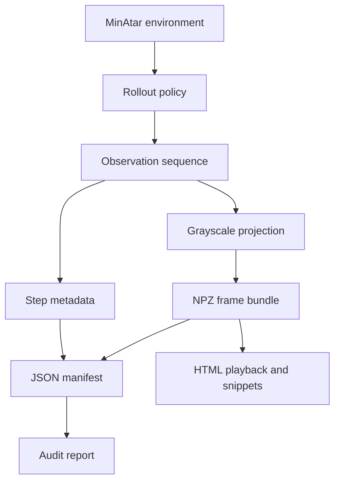

# MinAtar Frame Dataset Creation - Plan

## Goal Capsule

- **Objective:** Create the first dataset-creation track for Nano Pixel RL by extracting inspectable grayscale frame backlogs from MinAtar games.
- **Product authority:** `STRATEGY.md` defines the project as a nanochat-like visual-control benchmark trained from cross-entropy over curated visual trajectories.
- **Execution profile:** Small Python scaffold with MinAtar rollouts, saved frame bundles, manifest/audit output, and visual inspection helpers including an HTML playback viewer.
- **Stop conditions:** Stop before expert-agent training, model tokenization, pretraining, heldout evaluation, mechanics variants, or JAXAtari support.
- **Tail ownership:** Implementation owns creating the first runnable local dataset path and tests; later model work consumes the saved outputs.
- **Open blockers:** None.

---

## Product Contract

### Summary

Build a MinAtar-first dataset creation path that extracts normalized grayscale frame sequences and makes them easy to inspect before any model training work begins.
The first milestone is about trustworthy visual data output, playback, and audits, not control learning or heldout-game evaluation.

### Problem Frame

Nano Pixel RL needs a reliable visual trajectory corpus before model architecture or pretraining choices can be evaluated.
The current strategy argues for tiny hackable visual games, and MinAtar is a useful first source because its five Atari-like games are small enough to run and inspect cheaply on limited GPU hardware.
The immediate risk is not model quality; it is silently creating frames that look wrong, have inconsistent shapes, or cannot be replayed by a human reviewer.

### Key Decisions

- **MinAtar first, JAXAtari later.** Start with MinAtar because its 10x10 games are cheap and debuggable; keep JAXAtari as a future compatible source once the dataset contract works.
- **Grayscale is the model-facing source of truth.** The dataset should train future models on normalized visual frames rather than object-channel identifiers, because game-specific object IDs could weaken cross-game transfer.
- **Dataset creation is separate from training.** The v1 work should produce frame outputs and inspection tools without deciding model prompts, heldout splits, or control objectives.
- **Visual inspection is mandatory.** Playback and snippet review are first-class requirements because grayscale conversion errors are easier to catch by looking than by reading metadata.

### Requirements

**Frame Extraction**

- R1. The dataset creator must extract frame sequences from all five MinAtar games: `asterix`, `breakout`, `freeway`, `seaquest`, and `space_invaders`.
- R2. Each saved model-facing frame must be a grayscale image normalized to the `0..1` range.
- R3. Each dataset item must preserve enough episode context to associate a frame with its game, episode, timestep, action, reward, terminal state, and generation seed.
- R4. The first dataset milestone should save frame outputs directly and avoid requiring model-specific tokenization.

**Inspection And Playback**

- R5. The dataset track must include a browser-based HTML viewer that plays back saved frame sequences for human inspection.
- R6. The dataset track must include a way to produce short visual snippets or contact sheets from saved frames.
- R7. Playback must use the saved grayscale outputs, not a fresh environment render, so inspection validates the actual training-facing artifact.

**Audits**

- R8. The dataset creator must report frame shape, dtype or numeric range, frame count, episode count, and per-game coverage for every generated dataset run.
- R9. The audit must fail or clearly flag outputs whose frame size, value range, or episode metadata are inconsistent.
- R10. Dataset runs must emit a manifest that lets a future planner or reviewer identify what games, seeds, policy source, and settings produced the frames.

**Scope Control**

- R11. The first implementation must not depend on trained expert agents being available.
- R12. The first implementation must support simple policy sources such as random or legal-action rollouts so the extraction path can be validated before expert data exists.

### Key Flows

- F1. Dataset run
  - **Trigger:** A contributor asks for a MinAtar frame backlog.
  - **Steps:** The dataset creator rolls out configured games, converts observations into normalized grayscale frames, saves frame sequences, and writes a manifest.
  - **Outcome:** The contributor has saved grayscale frames plus metadata sufficient for inspection and later planning.
  - **Covered by:** R1, R2, R3, R4, R10, R11, R12

- F2. Visual audit
  - **Trigger:** A contributor wants to verify a generated backlog.
  - **Steps:** The inspection helper loads saved frames, plays back an episode or emits snippets, and reports shape and value-range checks.
  - **Outcome:** The contributor can confirm that the model-facing frames look like playable visual states.
  - **Covered by:** R5, R6, R7, R8, R9

### Acceptance Examples

- AE1. **Covers R2, R7, R8.** Given a generated `breakout` episode, when the playback helper displays it, then the frames shown are the saved normalized grayscale frames and the audit reports a stable 10x10 frame shape.
- AE2. **Covers R1, R8, R10.** Given a dataset run over the default game set, when the run completes, then the manifest and audit identify all five MinAtar games and their frame counts.
- AE3. **Covers R9.** Given a corrupted or mismatched saved frame sequence, when the audit runs, then it flags the inconsistency instead of treating the dataset as valid.
- AE4. **Covers R11, R12.** Given no trained agents are available, when a contributor runs the first extractor, then it can still produce inspectable frame output using a simple rollout policy.

### Success Criteria

- A contributor can generate a small MinAtar grayscale frame backlog without training any model.
- A contributor can inspect saved frames through playback or snippets and decide whether the visual data looks correct.
- A future implementation plan can build from this artifact without inventing the dataset milestone's purpose, model-facing frame format, or inspection requirements.

### Scope Boundaries

- Expert-agent training and checkpoint selection are deferred.
- Model tokenization, pretraining, prompting, and heldout evaluation are deferred.
- Mechanics variants, cross-game mechanic transfer, and heldout-variant splits are deferred until the frame backlog is reliable.
- JAXAtari support is deferred, though the grayscale frame contract should not block adding it later.
- Raw MinAtar object-channel state is not a v1 training artifact requirement; visual grayscale output and playback are the priority.

### Dependencies / Assumptions

- MinAtar can provide enough frame signal for an initial dataset pipeline even if it is not sufficient for the final benchmark.
- Grayscale projection can be visually inspected well enough to catch major representation errors.
- Future work may add richer sources or variants, but the initial dataset path should stay small enough to run quickly on limited local or remote hardware.

### Sources / Research

- `STRATEGY.md` frames Nano Pixel RL as a small visual-control benchmark and explicitly prefers tiny hackable games for v1.
- MinAtar provides five small Atari-like games with 10x10 state structure: https://github.com/kenjyoung/MinAtar
- JAXAtari provides future-compatible pixel observation wrappers with grayscale and normalization support: https://jaxatari.readthedocs.io/en/latest/api/wrappers.html

---

## Planning Contract

### Key Technical Decisions

- **KTD1. Use a small Python package under `dataset_creation/`.** The repo has no code scaffold yet, and the user asked for dataset creation to be at least separated as a monorepo subfolder.
- **KTD2. Store generated runs as `.npz` frame bundles plus JSON manifests.** NumPy bundles are simple for `10x10` normalized frame arrays, while JSON keeps audit and provenance readable without inventing a database or dataset registry.
- **KTD3. Project MinAtar object planes to object-agnostic grayscale occupancy.** For v1, a pixel is model-facing white when any object occupies it and black when empty, avoiding stable object-ID brightness that could teach game-specific labels.
- **KTD4. Keep policy execution pluggable but implement only random/legal rollout first.** The extractor contract should name the policy source, but trained experts are deferred and must not block frame generation.
- **KTD5. Make visual QA consume saved artifacts only.** HTML playback, GIFs, and contact sheets must load the saved frame bundle so visual inspection proves the same artifact that future training will read.

### High-Level Technical Design

The initial dataset path has four small components: a MinAtar rollout adapter, a grayscale frame projector, a run writer, and inspection/audit helpers.
The writer persists model-facing frames and per-step metadata, then writes a manifest that summarizes the run and points to the saved arrays.

### Planned File Layout

- `pyproject.toml` defines the Python project, dependencies, and test entry points.
- `dataset_creation/README.md` documents the first dataset flow and artifact shape.
- `dataset_creation/nanovision_dataset/__init__.py` exposes the package.
- `dataset_creation/nanovision_dataset/minatar_source.py` owns MinAtar rollout setup and simple policy behavior.
- `dataset_creation/nanovision_dataset/grayscale.py` owns object-plane to grayscale projection and frame validation.
- `dataset_creation/nanovision_dataset/writer.py` owns saved run layout, `.npz` writing, metadata, and manifest creation.
- `dataset_creation/nanovision_dataset/inspect.py` owns audit summaries, playback loading, HTML playback export, GIF export, and contact sheet export.
- `dataset_creation/nanovision_dataset/cli.py` exposes thin commands for generation and inspection.
- `tests/dataset_creation/` contains focused tests for projection, writing, audits, and smoke generation.
- `artifacts/datasets/` is the default generated-output root and should be ignored by version control once a git repo exists.

### Data Contract

Each generated run should contain a manifest and one or more frame bundles.
The manifest should include game names, seed range, policy source, episode counts, frame counts, frame shape, numeric range, package versions where available, and paths to generated bundles.
Each frame bundle should include a `frames` array shaped as episodes or flat timesteps with `10x10` grayscale values, plus enough aligned metadata arrays to recover game, episode, timestep, action, reward, and terminal state.

### Sequencing

1. Create the Python scaffold and dependency baseline.
2. Implement grayscale projection and validation tests before rollout writing.
3. Implement a one-game random rollout smoke path and saved run contract.
4. Expand generation to all five MinAtar games and write manifest/audit summaries.
5. Add HTML playback/export helpers that read saved artifacts.
6. Add documentation and final verification commands.

### Risks & Dependencies

- **MinAtar install/API drift:** Pin or document the tested dependency version during implementation, and keep the adapter thin enough to repair quickly.
- **Grayscale semantics may be too lossy:** This is accepted for v1; richer brightness mappings can be tested after the saved-artifact pipeline works.
- **Generated artifacts can grow quickly:** Keep defaults tiny and mark generated dataset output as rebuildable.
- **Fresh repo scaffolding risk:** Because no package conventions exist yet, the first implementation should prefer a minimal `uv`/pytest setup over a broad framework.

---

## Implementation Units

### U1. Python Dataset Scaffold

- **Goal:** Create the minimal Python project structure for dataset creation.
- **Requirements:** Supports R1-R12 by giving the later units a runnable package and test harness.
- **Files:** `pyproject.toml`, `dataset_creation/README.md`, `dataset_creation/nanovision_dataset/__init__.py`, `.gitignore`
- **Approach:** Define a small package with runtime dependencies for MinAtar, NumPy, and image export, a `nanovision-dataset` console entry point, and pytest for validation.
- **Test Scenarios:** Project metadata installs in editable mode; `uv run nanovision-dataset --help` reaches the CLI; pytest discovers `tests/dataset_creation/`; generated artifact paths are ignored or documented as rebuildable.
- **Verification:** `uv run pytest tests/dataset_creation`

### U2. Grayscale Projection And Validation

- **Goal:** Convert MinAtar observations into object-agnostic normalized grayscale frames.
- **Requirements:** R2, R7, R8, R9
- **Files:** `dataset_creation/nanovision_dataset/grayscale.py`, `tests/dataset_creation/test_grayscale.py`
- **Approach:** Implement projection from `H x W x C` object planes to `H x W` float frames using occupancy, then centralize shape, finite-value, and range validation.
- **Test Scenarios:** Empty object planes produce all-zero frames; a single occupied cell in any channel produces `1.0`; multi-channel overlap still produces `1.0`; invalid rank, NaN, or out-of-range data is rejected.
- **Verification:** `uv run pytest tests/dataset_creation/test_grayscale.py`

### U3. MinAtar Rollout Source

- **Goal:** Generate deterministic simple-policy rollouts for the five MinAtar games.
- **Requirements:** R1, R3, R11, R12, F1, AE4
- **Files:** `dataset_creation/nanovision_dataset/minatar_source.py`, `tests/dataset_creation/test_minatar_source.py`
- **Approach:** Wrap MinAtar environment creation, seeding, game iteration, and random/legal action selection behind a small source interface.
- **Test Scenarios:** A seeded smoke rollout returns frames and aligned metadata; the default game list contains exactly the five required games; rollout works without trained-agent files; terminal states end episodes cleanly.
- **Verification:** `uv run pytest tests/dataset_creation/test_minatar_source.py`

### U4. Run Writer And Manifest

- **Goal:** Persist generated frame backlogs and readable run metadata.
- **Requirements:** R3, R4, R8, R9, R10, F1, AE2, AE3
- **Files:** `dataset_creation/nanovision_dataset/writer.py`, `tests/dataset_creation/test_writer.py`
- **Approach:** Save frame arrays and aligned step metadata to `.npz`, then write a JSON manifest with run settings, coverage, frame statistics, and bundle paths.
- **Test Scenarios:** A tiny synthetic run writes loadable `.npz` data; manifest frame counts match arrays; inconsistent metadata lengths fail validation; per-game coverage appears in the manifest.
- **Verification:** `uv run pytest tests/dataset_creation/test_writer.py`

### U5. Inspection And Visual Export Helpers

- **Goal:** Let contributors inspect saved grayscale frames in a browser or exported visual snippets without rerunning environments.
- **Requirements:** R5, R6, R7, R8, R9, F2, AE1, AE3
- **Files:** `dataset_creation/nanovision_dataset/inspect.py`, `tests/dataset_creation/test_inspect.py`
- **Approach:** Load saved bundles, produce audit summaries, export a self-contained HTML playback viewer, export short GIF snippets, and export contact sheet PNGs using the saved `frames` array.
- **Test Scenarios:** Audit reports shape, range, episode count, frame count, and per-game counts; HTML/GIF/contact sheet export reads from saved frames; corrupt bundles are flagged; snippet limits keep exports small.
- **Verification:** `uv run pytest tests/dataset_creation/test_inspect.py`

### U6. CLI And End-To-End Smoke

- **Goal:** Provide one-command generation and inspection flows for the first dataset backlog.
- **Requirements:** R1-R12, F1, F2, AE1-AE4
- **Files:** `dataset_creation/nanovision_dataset/cli.py`, `tests/dataset_creation/test_cli.py`, `dataset_creation/README.md`
- **Approach:** Add thin commands for generating a small default dataset, auditing a saved run, and exporting a snippet or contact sheet.
- **Test Scenarios:** CLI can generate a tiny one-episode run for one game in a temp directory; audit command returns a successful summary for valid output; export command creates a visual artifact from saved frames; README commands match the implemented CLI.
- **Verification:** `uv run pytest tests/dataset_creation/test_cli.py`

---

## Verification Contract

| Gate | Command | Proves |
|---|---|---|
| Unit tests | `uv run pytest tests/dataset_creation` | Projection, rollout, writing, inspection, and CLI behavior satisfy unit-level scenarios. |
| Smoke generation | `uv run nanovision-dataset generate --games breakout --episodes 1 --seed 0 --out artifacts/datasets/smoke` | The package can generate a tiny saved frame backlog without trained agents. |
| Smoke audit | `uv run nanovision-dataset audit artifacts/datasets/smoke` | The saved backlog reports valid shape, range, counts, and manifest coverage. |
| Smoke HTML playback export | `uv run nanovision-dataset export-html artifacts/datasets/smoke --out artifacts/datasets/smoke/viewer.html` | Visual QA reads saved frames and emits a browser playback viewer suitable for phone preview. |
| Smoke visual export | `uv run nanovision-dataset export-snippet artifacts/datasets/smoke --out artifacts/datasets/smoke/snippet.gif` | Visual QA reads saved frames and emits an inspectable snippet. |

If the final CLI names differ during implementation, update this contract in the same change so the plan remains executable.

---

## Definition of Done

- The repository has a minimal Python dataset-creation package under `dataset_creation/`.
- The default dataset generation path can produce saved grayscale MinAtar frames without trained agents.
- Generated frames are normalized to `0..1` and validated for stable shape and range.
- A manifest records game, seed, policy source, frame count, episode count, and output bundle paths.
- HTML playback and export helpers inspect saved frames rather than rerendering environments.
- Tests cover grayscale projection, writer validation, audit behavior, and a tiny generation path.
- Documentation shows how to generate, audit, and visually inspect a small backlog.
- Rebuildable dataset outputs are not staged as source files.
- Abandoned experiments or alternate storage formats are removed from the final diff.
